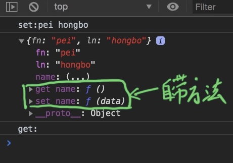

#ES567 基礎

# ES5

## Strict Mode

1. 理解:
  * 除了正常运行模式(混杂模式)，ES5添加了第二种运行模式："严格模式"（strict mode）。
  * 顾名思义，这种模式使得Javascript在更严格的语法条件下运行
2. 目的/作用
   * 消除Javascript语法的一些不合理、不严谨之处，减少一些怪异行为
   * 消除代码运行的一些不安全之处，为代码的安全运行保驾护航
   * 为未来新版本的Javascript做好铺垫
3. 使用
  * 在全局或函数的第一条语句定义为: 'use strict';
  * 如果浏览器不支持, 只解析为一条简单的语句, 没有任何副作用
4. 语法和行为改变
   * 必须用var声明变量
   * 禁止自定义的函数中的this指向window
   * 创建eval作用域
   * 对象不能有重名的属性

```javascript
4(2).//禁止自定义的函数中的this指向window
  'use strict'
function fun(name) {
  this.name = name;
}
  fun('tim');     //禁止自定义的函数中的this指向window
new fun('tim');   // OK
```

```javascript
4(3).创建eval作用域
             var str = 'a';   eval('var str = "b"; alert(str)')    alert(str);
//不用strict 两次一样 因为eval没有自己的scope 使用全局scope

'use strict' var str = 'a';   eval('var str = "b"; alert(str)')    alert(str);
//使用strict 一次b一次a  创建eval作用域
```

## JSON object

+ JSON.stringify(obj/arr)
  * js对象(数组)转换为json对象(数组)
+ JSON.parse(json)
  * json对象(数组)转换为js对象(数组)

## Object extend

### Object.create( , )

**Object.create(prototype, [descriptors])**

  * 作用: 以指定对象为原型创建新的对象
  * 为新的对象指定新的属性, 并对属性进行描述
    - value : 指定值
    - writable : 标识当前属性值是否是可修改的, 默认为false
    - configurable: 标识当前属性是否可以被删除 默认为false
    - enumerable： 标识当前属性是否能用for in 枚举 默认为false
```javascript
var obj = { name:'phb' }
var obj1 = Object.create(obj);  // obj的属性 加到obj1的protype里 

 obj1 = Object.create(obj,{
    sex: {
      value : 'male',
      writable : false,
      configurable : false,
      enumerable : false
    }
  });
// male
  obj1.sex = 'female';  //male 因为writable : false
del obj.sex;    //male删不掉。 因为 configurable : false,
for(var i in obj1){console.log(i)} //枚举不出来sex。因为enumerable : false
```
### Object.defineProperties( , )

**Object.defineProperties(object, descriptors)**

  * 作用: 为指定对象定义扩展多个属性
    * get ：用来获取当前属性值得回调函数 **没法被直接修改**
    * set ：修改当前属性值得触发的回调函数，并且实参即为修改后的值
   * 存取器属性：setter,getter一个用来存值，一个用来取值
```javascript
  var obj2 = {fn:'裴',ln:'宏博'};
  Object.defineProperties(obj2,{  //1
    name:{
      get: function () {
         console.log('get:');  //8 
        return this.fn+' '+this.ln    //2
      },
      set: function (data) {  //监听拓展事件 当扩展属性发生变化时自动调用,
        //data为尝试修改属性的 值
        console.log('set:'+data);   //3
        //虽然没法直接修改extend属性 但可以修改原有属性来 动态改变get的return
        var nameArr = data.split(' ');  //4
        this.fn = nameArr[0];
        this.ln = nameArr[1];
      }
    }
  });
  obj2.name = 'pei hongbo';   //5
  console.log(obj2);       //6
  console.log(obj2.name);  //7
//执行顺序 1 5 3 4 6 7 8 2
注意：
 5 --> 3 尝试修改值时 才会调用set
 7 -->82 尝试读取值时 才会调用get
 6 惰性求值 点击name:(…)时才会求值 并再一次调用set
```




## Array extend

###indexOf    lastIndexOf 

###forEach  map  filter

+ Array.prototype.indexOf(value) : 得到值在数组中的第一个下标
+ Array.prototype.lastIndexOf(value) : 得到值在数组中的最后一个下标
+ Array.prototype.forEach(function(item, index){}) : 遍历数组
+ Array.prototype.map(function(item, index){}) : 遍历数组返回一个新的数组，返回加工之后的值
+ Array.prototype.filter(function(item, index){}) : 遍历过滤出一个新的子数组， 返回条件为true的值

```javascript
  /*
   需求:
   1. 输出第一个6的下标
   2. 输出最后一个6的下标
   3. 输出所有元素的值和下标
   4. 根据arr产生一个新数组,要求每个元素都比原来大10
   5. 根据arr产生一个新数组, 返回的每个元素要>4 <7
   */
var arr = [1,2,3,6,4,5,6,7,8,9,6];
console.log(arr.indexOf(6));
console.log(arr.lastIndexOf(6));
console.log(arr.forEach(function (item,index) {
  console.log(item+'~'+index)
}));
var cno = arr.map(function (item,index) {
  return   item + 10 ;
})
console.log(cno);
console.log(arr.filter(function (item,index) {
  return item > 4 && item < 7
}))
```

## Function extend

### bind call apply

```html
<!--
1. Function.prototype.bind(obj) :
  * 作用: 将函数内的this绑定为obj, 并将函数返回
2. 面试题: 区别bind()与call()和apply()?
  * 都能指定函数中的this
  * call()/apply()是立即调用函数
  * bind()是将函数返回
-->
```

```javascript
var obj = {name:'phb'};
function foo(data) {
  console.log(this,data)
}
foo.call(obj,20);      //可以传多个参
foo.apply(obj,[33]);   //只能传两个参 且第二个必为数组

foo.bind(obj);    //绑定完this不会立即调用当前函数 而是将函数返回     不会立即调用   传参同call
foo.bind(obj)()
```

```javascript
//为什么用bind？
setInterval(function () {
    console.log(this);
  }.bind(obj),1000);    //不会立即调用
```

# ES6

## let      &    const

+ 作用:
  * 与var类似, 用于声明一个变量
+ 特点:
  * 在块作用域内有效
  * 不能重复声明
  * 不会预处理, 不存在提升
+ 应用:
  * 循环遍历加监听
  * 使用let取代var是趋势

```javascript
//let & var
 for(let/var i =0 ;i< btns.length;i++){
    var btn = btns[i];
    btn.onclick = function () {
      alert(i);
    }
  }
//使用var时 当click时 for一经执行完了 i会去scope找她的值
//因为var 声明提前 去全局作用域找她的值 5

//使用let时 声明不提前 所以位于for的第一行
//所以每次click时 会去for的第一行找值 所以每次的值不一样
```

const

```html
<!--
1. 作用:
  * 定义一个常量
2. 特点:
  * 不能修改
  * 其它特点同let
3. 应用:
  * 保存不用改变的数据
-->
```

##  变量的解构赋值

+ 理解:
  * 从对象或数组中提取数据, 并赋值给变量(多个)
+ 对象的解构赋值
  let {n, a} = {n:'tom', a:12}
+ 数组的解构赋值
  let [a,b] = [1, 'atguigu'];
+ 用途
  * 给多个形参赋值
+ **解构**     解构什么类型 左边就是什么类型obj/arr

```javascript
 let obj = {name:'phb',age:'20',gender:'male'};
  //let name = obj.name
  // let age = obj.age

  let {name , age} = obj;  //等同于上面两句
  console.log(name,age);

 let arr=[1,5,7,9,'abc',true];
  let [a,,c,d,e] = arr;  //传啥都可以 包括空
  console.log(c, d, e);
//応用
  function foo({name,age}) {
    console.log(name, age);
  }
```

## Template String

```
 模板字符串 : 简化字符串的拼接
  * 模板字符串必须用 `` 包含
  * 变化的部分使用${xxx}定义
```

```javascript
let obj = {name:'phb',age:20};
  let str = 'My name:'+ obj.name + '.';
  str =`My name : ${obj.name}.`;
  console.log(str);
```

## 对象简写

+ 省略同名的属性值
+ 省略方法的function

```javascript
let name = 'phb';
let age = 20;
let obj = {
  name : name,
  age : age,
  getName : function () {
    return this.name;
  }
}
//简写
let obj = {
   name,      //省略同名的属性值 
   age,
   getName () {     //省略方法的function
     return this.name;
   }
 }
```

## Arrow Function

+ 作用: 定义匿名函数

+ 基本语法:
  * 没有参数: () => console.log('xxxx')
  * 一个参数: i => i+2
  * 大于一个参数: (i,j) => i+j
  * 函数体不用大括号: 默认返回结果
  * 函数体如果有多个语句, 需要用{}包围，若有需要返回的内容，需要手动返回

+ 使用场景: 多用来定义回调函数

+ 箭头函数的特点：
    1、简洁
    2、**箭头函数没有自己的this**，箭头函数的this不是调用的时候决定的，而是在定义的时候处在的对象就是它的this
    3、**扩展理解**： 箭头函数的this看外层的是否有函数，
        如果有，外层函数的this就是内部箭头函数的this，
        如果没有，则this是window。

    ​      如果外层还是arrow fun继续往上找

    4. 在使用箭头函数时，arguments 指向的对象并不是当前函数所属的argments，而是上级函数的arguments，所以需要将箭头函数转为function。

```javascript
let fun1 = () => console.log('i am fun1');  //没有引数的时候 括号不可省略

let fun2 = a => console.log(`i am fun${a}`); //fun2(2);  //引数が一つしかない時　括号可以省略

let fun3 = (x,y) => console.log(`i am ${x} and ${y}`); //fun3(3,4); 引数大于两个的时候 不可省略
```

**函数体**

```javascript
//函数体
//1.函数只有一条语句或者一条表达式 {}可以省略 ---->会自动返回语句执行的结果或者是表达式的结果
let fun4 = (x,y) => x + y;
console.log(fun4(12,28)); //40
// let fun4 = (x,y) => {x + y};  error
// let fun4 = (x,y) => { return x + y};  OK

//2.函数不止一条语句或表达式的情况
let fun5 = (x,y) => {
    console.log(x, y);
    console.log(x+y);
}
fun5(66,99);
```

**箭头函数没有自己的this**   也没有arguments

```javascript
btn1.onclick = function () {
    alert(this);      // [object HTMLButtonElement]
}
btn2.onclick = () => alert(this);  //window

let obj = {
    name:'phb',
    btn : function () {
        btn2.onclick = () => alert(this);
    }
}
obj.btn();    // obj

let obj = {
    name:'phb',
    btn : () => {
        btn2.onclick = () => alert(this);    //如果外层还是arrow fun继续往上找
    }
}
obj.btn();    //window
```

## ... operator

+ rest(可变)参数
  * 用来取代arguments 但比 arguments 灵活,只能是最后部分形参参数
  * 只能放在最好 表示除前面外 剩余的参数

```javascript
let fun =  (a,b,...cno) => {   //剩余的参数
    // console.log(arguments);   arrow fun 无 arguments
    console.log(cno);
    cno.forEach(function (item,index) {  //可以遍历
      console.log(item);
    })
  }
  fun(1,'abc',true,2,3,4);   // true 2 3 4
```

+ 扩展运算符

```javascript
 let arr1 = [1,5,8];
 let arr2 = [2,3,4,];
 let arr3 = [6,7];
 arr1 = [1,...arr2,5,...arr3,8];
 console.log(arr1);  // 1~8

 console.log(...arr2);  //相当于遍历 
```

## Promise

1. 理解:
  * Promise对象: 代表了未来某个将要发生的事件(通常是一个异步操作)
  * 有了promise对象, 可以将异步操作以同步的流程表达出来, 避免了层层嵌套的回调函数(俗称'回调地狱')
  * ES6的Promise是一个构造函数, 用来生成promise实例
2. 使用promise基本步骤(2步):
  * 创建promise对象
    let promise = new Promise((resolve, reject) => {
        //初始化promise状态为 pending
      //执行异步操作
      if(异步操作成功) {
        resolve(value);//修改promise的状态为fullfilled
      } else {
        reject(errMsg);//修改promise的状态为rejected
      }
    })
  * 调用promise的then()
    promise.then(function(
      result => console.log(result),
      errorMsg => alert(errorMsg)
    ))
3. promise对象的3个状态
  * pending: 初始化状态
  * fullfilled: 成功状态
  * rejected: 失败状态

## Symbol

前言：ES5中对象的属性名都是字符串，容易造成重名，污染环境
Symbol：
  概念：ES6中的添加了一种原始数据类型symbol(已有的原始数据类型：String, Number, boolean, null, undefined, 对象)
  特点：
    1、**Symbol属性值对应的值是唯一的**，解决命名冲突问题
    2、**Symbol值不能与其他数据进行计算，包括同字符串拼串**
    3、**for in, for of遍历时不会遍历symbol属性**。
  使用：
    1、调用Symbol函数得到symbol值

```javascript
let a = Symbol();
  let obj = {name:'ohb',age:20};
  obj[a] = '???';         //  {name: "ohb", age: 20, Symbol(): "???"}
```

​    2、传参标识

```javascript
 let a = Symbol();
  let b = Symbol();
  let fun = (a,b) => console.log(a, b, a === b);
  fun(a,b);   // Symbol() Symbol() false
  //上不传 下传
  let a = Symbol(0);
  let b = Symbol('嗯');
  let fun = (a,b) => console.log(a, b, a === b);
  fun(a,b);   // Symbol(0) Symbol(嗯) false
  
    
```

3、内置Symbol值

   * 除了定义自己使用的Symbol值以外，ES6还提供了11个内置的Symbol值，指向语言内部使用的方法。
      - Symbol.iterator
   * 对象的Symbol.iterator属性，指向该对象的默认遍历器方法  [for of](#forOf)

## iterator(イテレータ)

概念： iterator是一种接口机制，为各种不同的数据结构提供统一的访问机制
作用：
  1、为各种数据结构，提供一个统一的、简便的访问接口；
  2、使得数据结构的成员能够按某种次序排列
  3、ES6创造了一种新的遍历命令for...of循环，Iterator接口主要供for...of消费。
工作原理：
  - 创建一个指针对象(遍历器对象)，指向数据结构的起始位置。

  - 第一次调用next方法，指针自动指向数据结构的第一个成员

  - 接下来不断调用next方法，指针会一直往后移动，直到指向最后一个成员

  - 每调用next方法返回的是一个包含value和done的对象，{value: 当前成员的值,done: 布尔值}
    * value表示当前成员的值，done对应的布尔值表示当前的数据的结构是否遍历结束。
    * 当遍历结束的时候返回的value值是undefined，done值为false

    ```javascript
    // simulate iterator function
    let myIterator = (arr) => {
         let nextIndex = 0;    //记录指针位置
         return {
           next:function () {
             return nextIndex < arr.length ? {value:arr[nextIndex++],done:false} : {value:arr[nextIndex++],done:true}
           }
         }
       }
       let arr = [1,5,7,true,'abc'];
       let fun = myIterator(arr);
       console.log(fun.next()); //closure
       console.log(fun.next());
    ```

    + **原生具备iterator接口的数据(可用for of遍历)  イテラブル (Iterable)**
      1、Array
      2、arguments
      3、set容器
      4、map容器
      5、String
      。。。 object不可以

- 使用 … operator    解构赋值。默认去调用iterator接口

###<span id='forOf'>for of</span>

```javascript
//when use "for of" to traversal data, first find it's "Symbol.interator"
//if it has, go to traversal. Otherwise return "xxx is not interable"
//没有Symbol.interator 我就给你加一个
 let obj = {name:'ohb',age:20,
    [Symbol.iterator]:function () {
      let nextIndex = 0;   //
       let that = Object.keys(this);
      return {
          next:function () {
          return nextIndex < that.length ? {value:that[nextIndex++],done:false} : {value:that[nextIndex++],done:true}
        }
      }
    }
    };
for (let i of obj){
      console.log(i);
    }
```

## Generator

## Async

## class

1. 通过class定义类/实现类的继承
2. 在类中通过constructor定义构造方法
3. 通过new来创建类的实例

```javascript
 class Person {
    //类 的 构造方法    (放在__proto__上)
     constructor(name,age){
       this.name = name;
       this.age = age;
     }
   //类 的 一般方法 （必须用简写方式）(放在__proto__上)
    showName(){
       console.log(this.name);
    }

  }
  let person = new Person('phb',20);
  console.log(person);
  person.showName();
```

1. 通过extends来实现类的继承
2. 通过super调用父类的构造方法
3. 重写从父类中继承的一般方法

​       与其说重写不如说   子类的x方法在子类的 ```__proto__```上

​                                    而父类的x方法在子类的 ```__proto__.__proto__```上

```javascript
  //子类
  class supPerson extends Person { //通过extends来实现类的继承
     constructor(name,age,gender){
       super(name, age); //通过super调用父类的构造方法
       this.gender = gender;
    }
    showName(){        //重写从父类中继承的一般方法
      console.log('son');
      console.log(this.name);
    }
  }

  let pp = new supPerson('pp','22','male');
  console.log(pp);
  pp.showName();
```

## Other(あんまり使わん)


#  ES7

```
1. 指数运算符(幂): **
2. Array.prototype.includes(value) : 判断数组中是否包含指定value
```


